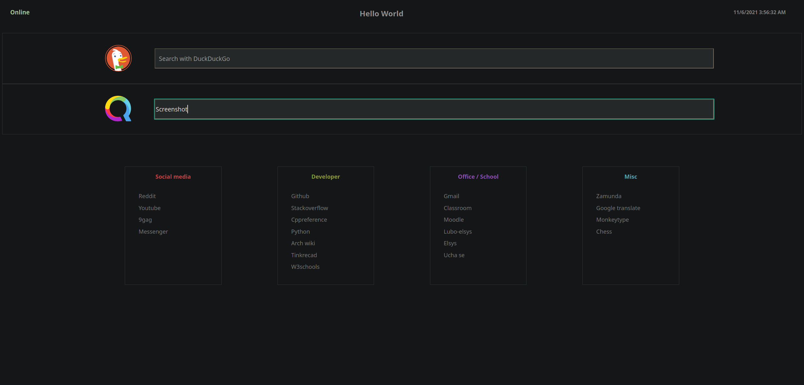

# Custom home / new tab page for firefox



# Homepage Setup
- after cloning the repo move /homepage to ```<user>/.mozilla/firefox``` or ```<user>/.mozilla/firefox/<profile>```
- make sure firefox isn't running
- to open the html file on startup add this line to ```<user>/.mozilla/firefox/<profile>/prefs.js``` :
~~~js
user_pref("browser.startup.homepage", <html file location>);
~~~

# New tab Setup
- add autoconfig.cfg to the main firefox dir - ```/usr/lib/firefox/```
- replace about:blank with ```<html file location>```
~~~js
var newTabURL = "about:blank"
~~~
- add autoconfig.js to ```/usr/lib/firefox/defaults/pref```